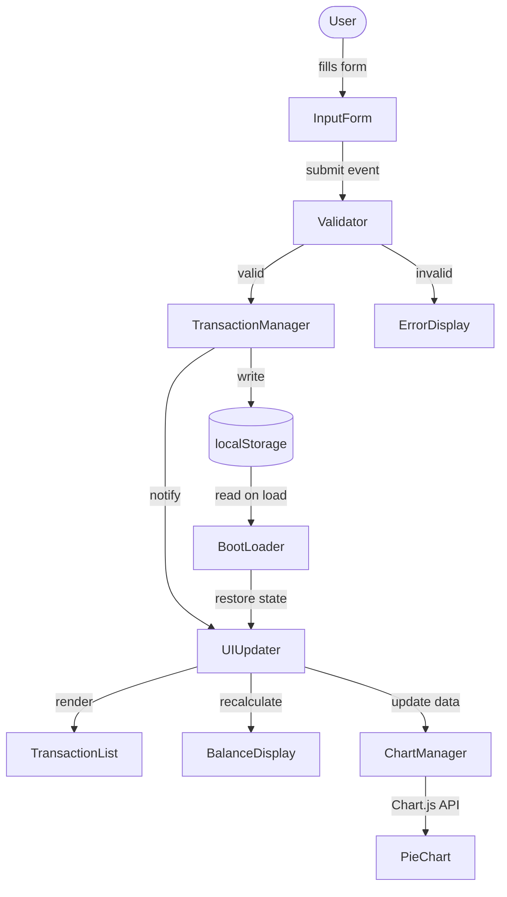

# Design Document: Expense & Budget Visualizer

## Overview

The Expense & Budget Visualizer is a fully client-side, mobile-friendly single-page web application. It records daily expenses, displays them in a scrollable transaction list, shows a running total balance, and renders an interactive pie chart of spending by category.

**Key constraints:**
- Exactly three files: `index.html`, `css/style.css`, `js/script.js`
- Vanilla JavaScript only — no frameworks, no build tools, no package manager
- Chart.js loaded from CDN for the pie chart
- Browser `localStorage` for persistence — no backend
- Must work on Chrome, Firefox, Edge, and Safari (current stable)
- Responsive layout from 320 px to 1440 px

Because all logic lives in one JS file the design focuses heavily on a clear function-responsibility breakdown that keeps the code easy to read without a module bundler.

---

## Architecture

### High-Level Data Flow



### Execution Lifecycle

1. **Boot** — `DOMContentLoaded` fires → `init()` reads localStorage, populates in-memory array, then calls all three render functions.
2. **Add transaction** — form submit → validate → push to array → persist → re-render list, balance, chart.
3. **Delete transaction** — delete button click → splice from array → persist → re-render list, balance, chart.
4. **No-data state** — if localStorage is empty, list renders empty, balance shows `$0.00`, chart shows a placeholder message.

### Component Breakdown

| Concern | Lives in | Notes |
|---|---|---|
| HTML structure | `index.html` | Semantic markup, Chart.js CDN `<script>`, viewport meta tag |
| Visual styling + responsive layout | `css/style.css` | Single file, mobile-first, flexbox/grid |
| All application logic | `js/script.js` | Named functions with single responsibilities |
| Pie chart rendering | Chart.js (CDN) | Loaded before `script.js` |

---

## Components and Interfaces

### `index.html` Structure

```
<body>
  <header>
    <h1>Expense & Budget Visualizer</h1>
    <div id="balance-display">Total Balance: $0.00</div>
  </header>

  <main>
    <section id="form-section">
      <form id="expense-form">
        <div class="field-group">
          <label for="item-name">Item Name</label>
          <input id="item-name" type="text" maxlength="100" />
          <span id="item-name-error" class="error-msg" aria-live="polite"></span>
        </div>
        <div class="field-group">
          <label for="amount">Amount</label>
          <input id="amount" type="number" step="0.01" min="0.01" max="999999999.99" />
          <span id="amount-error" class="error-msg" aria-live="polite"></span>
        </div>
        <div class="field-group">
          <label for="category">Category</label>
          <select id="category">
            <option value="">-- Select --</option>
            <option value="Food">Food</option>
            <option value="Transport">Transport</option>
            <option value="Fun">Fun</option>
          </select>
          <span id="category-error" class="error-msg" aria-live="polite"></span>
        </div>
        <button type="submit">Add Transaction</button>
      </form>
    </section>

    <section id="chart-section">
      <canvas id="spending-chart"></canvas>
      <p id="chart-placeholder" hidden>No spending data yet.</p>
    </section>

    <section id="list-section">
      <h2>Transactions</h2>
      <ul id="transaction-list"></ul>
    </section>
  </main>
</body>
```

### `js/script.js` — Named Function Interface

Each function has exactly one responsibility. They are organized into four logical groups.

#### State

```
let transactions = [];          // in-memory array of Transaction objects
let spendingChart = null;       // Chart.js instance (singleton)
```

#### Boot

| Function | Signature | Responsibility |
|---|---|---|
| `init` | `() → void` | Entry point; called on `DOMContentLoaded`. Checks API availability, loads from storage, wires events, calls all render functions. |
| `checkBrowserSupport` | `() → { supported: boolean, missing: string[] }` | Detects required Web APIs; returns list of missing features. |

#### Storage

| Function | Signature | Responsibility |
|---|---|---|
| `loadTransactions` | `() → Transaction[]` | Reads and parses JSON from `localStorage`. Returns empty array on miss or parse error. |
| `saveTransactions` | `(transactions: Transaction[]) → void` | Serializes array to JSON and writes to `localStorage`. Throws/calls `handleStorageError` on failure. |
| `handleStorageError` | `(operation: 'read' \| 'write', error: Error) → void` | Displays the storage error banner and logs the error. |

#### Validation

| Function | Signature | Responsibility |
|---|---|---|
| `validateForm` | `(formData: FormData) → ValidationResult` | Runs all field checks; returns `{ valid: boolean, errors: { field: string, message: string }[] }`. |
| `validateItemName` | `(value: string) → string \| null` | Returns error message or `null` if valid. |
| `validateAmount` | `(value: string) → string \| null` | Returns error message or `null` if valid. |
| `validateCategory` | `(value: string) → string \| null` | Returns error message or `null` if valid. |
| `displayValidationErrors` | `(errors: ValidationError[]) → void` | Writes error messages into the inline `<span>` elements. |
| `clearValidationErrors` | `() → void` | Clears all inline error spans. |

#### Transaction Management

| Function | Signature | Responsibility |
|---|---|---|
| `addTransaction` | `(itemName: string, amount: number, category: string) → Transaction` | Creates a `Transaction`, pushes to array, calls `saveTransactions`, calls render functions. |
| `deleteTransaction` | `(id: string) → void` | Splices transaction by ID, calls `saveTransactions`, calls render functions. |
| `generateId` | `() → string` | Returns a unique string ID (`crypto.randomUUID()` or timestamp fallback). |

#### Rendering

| Function | Signature | Responsibility |
|---|---|---|
| `renderTransactionList` | `(transactions: Transaction[]) → void` | Clears and rebuilds the `<ul>` from the current array (most-recent-first order). |
| `renderTransactionItem` | `(transaction: Transaction) → HTMLLIElement` | Creates and returns a single `<li>` element with item name, formatted amount, category, and delete button. |
| `formatAmount` | `(amount: number) → string` | Returns `"$1,234.56"` — currency symbol + 2 decimal places. |
| `renderBalance` | `(transactions: Transaction[]) → void` | Sums all amounts and updates the balance `<div>`. |
| `calculateTotal` | `(transactions: Transaction[]) → number` | Pure function; returns the numeric sum of all transaction amounts. |
| `renderChart` | `(transactions: Transaction[]) → void` | Aggregates amounts by category and calls `updateChart` or shows the placeholder. |
| `aggregateByCategory` | `(transactions: Transaction[]) → Record<string, number>` | Pure function; returns `{ Food: 12.5, Transport: 30, Fun: 5 }`. |
| `updateChart` | `(categoryTotals: Record<string, number>) → void` | Creates or updates the Chart.js instance with new data. |
| `showChartPlaceholder` | `() → void` | Shows the placeholder `<p>` and hides the `<canvas>`. |
| `hideChartPlaceholder` | `() → void` | Hides the placeholder `<p>` and shows the `<canvas>`. |

#### Event Wiring

| Function | Signature | Responsibility |
|---|---|---|
| `attachEventListeners` | `() → void` | Binds the form `submit` handler and delegates the list delete-button `click` handler. |
| `handleFormSubmit` | `(event: Event) → void` | Reads form values, calls `validateForm`, branches to `displayValidationErrors` or `addTransaction`. Resets form on success. |
| `handleDeleteClick` | `(event: Event) → void` | Reads `data-id` from the clicked delete button, calls `deleteTransaction`. |

---

## Data Models

### Transaction Object

```json
{
  "id": "a3f9c2b1-...",
  "itemName": "Coffee",
  "amount": 4.50,
  "category": "Food",
  "createdAt": 1718000000000
}
```

| Field | Type | Constraints |
|---|---|---|
| `id` | `string` | Unique, generated via `crypto.randomUUID()` or timestamp fallback |
| `itemName` | `string` | 1–100 characters, non-empty after trim |
| `amount` | `number` | 0.01 ≤ amount ≤ 999,999,999.99, finite, not NaN |
| `category` | `string` | One of `"Food"`, `"Transport"`, `"Fun"` |
| `createdAt` | `number` | Unix timestamp (ms) set at creation time |

### LocalStorage Schema

| Key | Value |
|---|---|
| `"expense_transactions"` | JSON-serialized `Transaction[]` |

Example:
```
localStorage.key  → "expense_transactions"
localStorage.value → '[{"id":"...","itemName":"Coffee","amount":4.5,"category":"Food","createdAt":1718000000000}]'
```

On load, the value is parsed with `JSON.parse`. If the key is absent, the result is treated as an empty array. If `JSON.parse` throws, the error is caught, `handleStorageError('read', err)` is called, and the app initializes with an empty array.

### ValidationResult

```typescript
interface ValidationResult {
  valid: boolean;
  errors: ValidationError[];
}

interface ValidationError {
  field: "itemName" | "amount" | "category";
  message: string;
}
```

### Category Color Map

Fixed mapping used by Chart.js so colors are always consistent:

```javascript
const CATEGORY_COLORS = {
  Food:      "#FF6384",
  Transport: "#36A2EB",
  Fun:       "#FFCE56"
};
```

Additional categories (if the list ever grows) are assigned from a rotation of accessible colors, ensuring no two adjacent slices share the same color.

---

## CSS Layout Approach

### Strategy: Mobile-First Flexbox + CSS Grid

The stylesheet uses mobile-first media queries. The base layout (≤ 599 px) stacks all sections vertically. Wider breakpoints introduce a two-column grid.

```
/* Base — single column (320px+) */
main {
  display: flex;
  flex-direction: column;
  gap: 1rem;
  padding: 1rem;
}

/* Two-column layout (≥ 600px) */
@media (min-width: 600px) {
  main {
    display: grid;
    grid-template-columns: 1fr 1fr;
    grid-template-areas:
      "form  chart"
      "list  list";
  }
}

/* Wide desktop (≥ 1024px) */
@media (min-width: 1024px) {
  main {
    grid-template-columns: 360px 1fr;
    max-width: 1200px;
    margin: 0 auto;
  }
}
```

### Touch Target Sizes

All interactive controls (inputs, selects, buttons, delete buttons) have:
```css
min-height: 44px;
min-width: 44px;
```

### Pie Chart Resizing

The chart canvas sits inside a responsive container. Chart.js `responsive: true` and `maintainAspectRatio: true` handle proportional resizing automatically:

```javascript
new Chart(ctx, {
  options: {
    responsive: true,
    maintainAspectRatio: true
  }
});
```

The parent container uses `width: 100%` so the chart never overflows its column.

---

## Chart.js Integration Approach

Chart.js is loaded via CDN before `script.js`:
```html
<script src="https://cdn.jsdelivr.net/npm/chart.js@4/dist/chart.umd.min.js"></script>
<script src="js/script.js"></script>
```

The `spendingChart` variable is module-scoped. On the first render with data, a `new Chart(...)` instance is created. On subsequent updates, `spendingChart.data.datasets[0].data` and `.labels` are updated in place and `spendingChart.update()` is called — this avoids destroying and recreating the canvas, keeping transitions smooth.

When transactions are empty, `spendingChart` is destroyed (if it exists), the canvas is hidden, and the placeholder paragraph is shown.

---

## Error Handling

| Scenario | Behavior |
|---|---|
| Required Web API unavailable (localStorage, DOM) | `checkBrowserSupport()` detects missing APIs; a full-page error banner is shown listing the missing feature(s); the rest of the app does not initialize |
| `localStorage.getItem` throws or returns unparseable JSON | `handleStorageError('read', err)` shows a dismissible error banner; app initializes with empty array |
| `localStorage.setItem` throws (e.g., storage quota exceeded) | `handleStorageError('write', err)` shows a dismissible error banner; in-memory state is still updated so the UI remains functional |
| Form submitted with invalid fields | Inline error messages appear next to each failing field; no transaction is added; focus moved to first error field |
| `crypto.randomUUID` unavailable | Fallback ID generated as `Date.now().toString(36) + Math.random().toString(36).slice(2)` |

### Error Banner HTML (injected dynamically)

```html
<div id="error-banner" class="error-banner" role="alert" aria-live="assertive">
  <p id="error-banner-message"></p>
  <button id="error-banner-close" aria-label="Dismiss error">×</button>
</div>
```

---

## Correctness Properties

*A property is a characteristic or behavior that should hold true across all valid executions of a system — essentially, a formal statement about what the system should do. Properties serve as the bridge between human-readable specifications and machine-verifiable correctness guarantees.*

### Property 1: Valid transaction grows the list by exactly one

*For any* existing list of transactions and any valid transaction (non-empty item name ≤ 100 chars, amount between 0.01 and 999,999,999.99, valid category), calling `addTransaction` produces a list whose length is exactly one greater than the original.

**Validates: Requirements 1.7, 2.1**

---

### Property 2: Whitespace-only item names are rejected

*For any* string composed entirely of whitespace characters (spaces, tabs, newlines), `validateItemName` returns a non-null error message, meaning no transaction is created and the list is unchanged.

**Validates: Requirements 1.3, 1.6**

---

### Property 3: Amount boundary validation

*For any* numeric string outside the range [0.01, 999,999,999.99] (including zero, negative values, non-finite numbers, and values above the max), `validateAmount` returns a non-null error message.

**Validates: Requirements 1.4, 1.6**

---

### Property 4: Delete removes exactly the targeted transaction

*For any* transaction list containing at least one entry and any valid transaction ID present in that list, calling `deleteTransaction` produces a list that no longer contains the transaction with that ID, and all other transactions remain unchanged.

**Validates: Requirements 2.4**

---

### Property 5: Total balance equals sum of all amounts

*For any* list of transactions, `calculateTotal` returns a value equal to the arithmetic sum of all transaction `amount` fields, accurate to 2 decimal places.

**Validates: Requirements 3.1, 3.2, 3.3, 3.4, 3.5**

---

### Property 6: Category aggregation covers all transactions

*For any* non-empty transaction list, `aggregateByCategory` returns an object where the sum of all category values equals the result of `calculateTotal` applied to the same list.

**Validates: Requirements 4.1**

---

### Property 7: LocalStorage round-trip preserves transactions

*For any* array of valid Transaction objects, serializing to localStorage via `saveTransactions` and then reading back via `loadTransactions` produces an array whose members are structurally equal (same id, itemName, amount, category, createdAt) to the originals.

**Validates: Requirements 5.1, 5.2, 5.3**

---

### Property 8: formatAmount always produces a 2-decimal currency string

*For any* finite positive number, `formatAmount` returns a string that ends with exactly two digits after a decimal point and is prefixed with the currency symbol `$`.

**Validates: Requirements 2.2, 3.1**

---

## Testing Strategy

### Dual Testing Approach

Unit tests and property-based tests are complementary. Unit tests cover specific examples, integration points, and error branches. Property-based tests verify universal invariants across randomly generated inputs.

**Property-Based Testing Library**: [fast-check](https://github.com/dubzzz/fast-check) (JavaScript, works in browser and Node.js, no build tool required for test execution with a simple Node test runner).

### Unit Tests (Example-Based)

Focus areas:
- `checkBrowserSupport` returns correct results when APIs are mocked out
- `handleStorageError` renders the error banner with the correct message
- `renderTransactionItem` produces an `<li>` with the correct text content and `data-id` attribute
- `showChartPlaceholder` / `hideChartPlaceholder` toggle the correct elements
- `init` with an empty localStorage renders an empty list and `$0.00` balance
- `init` with a pre-populated localStorage renders correct list, balance, and chart data
- Form submit with all fields empty shows three inline error messages
- Deleting the only transaction shows the chart placeholder

### Property-Based Tests (fast-check)

Each test runs a minimum of **100 iterations** and is tagged with the design property it validates.

| Test | Property | fast-check Arbitraries |
|---|---|---|
| Adding a valid transaction increases list length by 1 | Property 1 | `fc.record({ itemName: fc.string({ minLength: 1, maxLength: 100 }).filter(s => s.trim().length > 0), amount: fc.float({ min: 0.01, max: 999999999.99 }), category: fc.constantFrom('Food','Transport','Fun') })` |
| Whitespace-only names are always rejected | Property 2 | `fc.stringOf(fc.constantFrom(' ','\t','\n'), { minLength: 1 })` |
| Out-of-range amounts are always rejected | Property 3 | `fc.oneof(fc.float({ max: 0 }), fc.float({ min: 1000000000 }), fc.constant(NaN), fc.constant(Infinity))` |
| Delete removes only the targeted transaction | Property 4 | `fc.array(transactionArbitrary, { minLength: 1 })` + `fc.nat` to pick index |
| calculateTotal equals sum of amounts | Property 5 | `fc.array(transactionArbitrary)` |
| aggregateByCategory totals match calculateTotal | Property 6 | `fc.array(transactionArbitrary, { minLength: 1 })` |
| localStorage round-trip preserves data | Property 7 | `fc.array(transactionArbitrary)` |
| formatAmount always ends with 2 decimal digits | Property 8 | `fc.float({ min: 0.01, max: 999999999.99, noNaN: true })` |

**Tag format:** `// Feature: expense-budget-visualizer, Property {N}: {property_text}`

Each property-based test references the design property number in a comment directly above the `fc.assert` call so test failures are traceable back to this document.

### Integration / Smoke Tests

- Load the app in a headless browser (e.g., Playwright) and verify:
  - Page renders without JS errors
  - Adding a transaction updates balance and chart (1-2 examples)
  - Refreshing the page restores the transaction list from localStorage (1 example)
  - Deleting all transactions shows the chart placeholder (1 example)
- These are not property-based — they verify end-to-end wiring with concrete examples.
